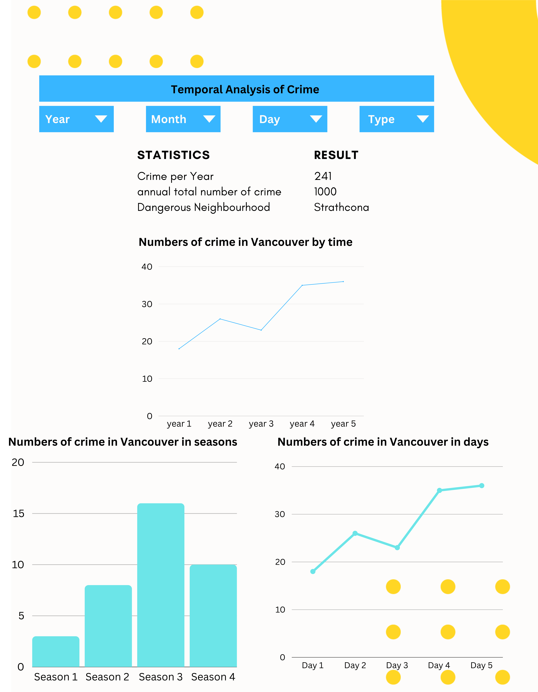
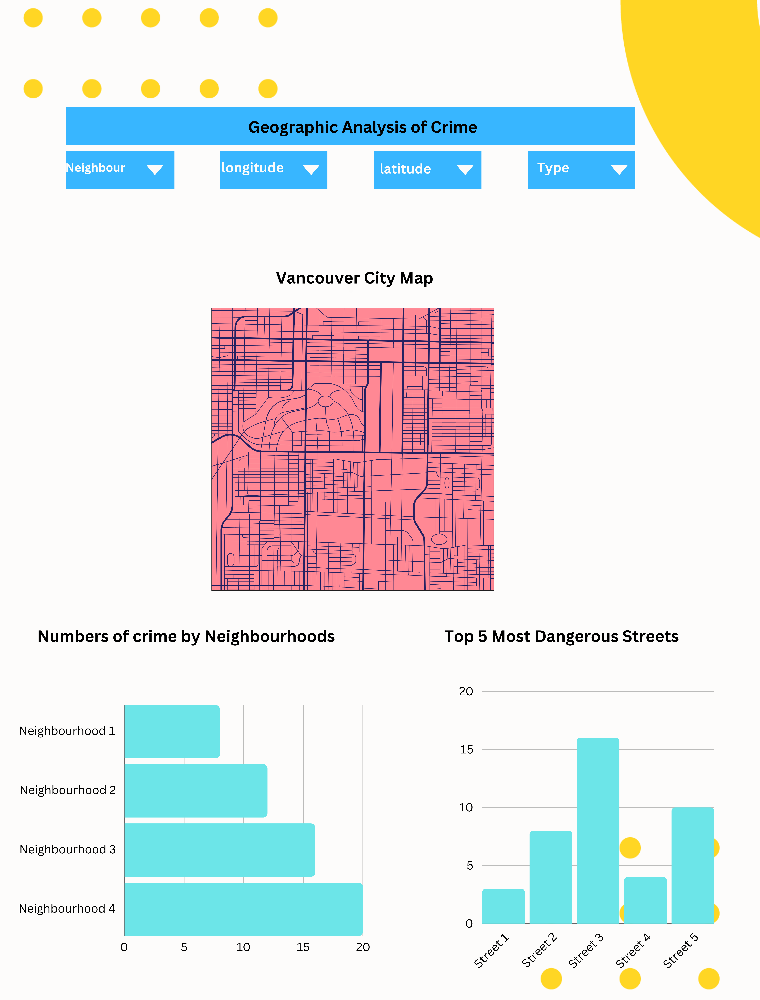

# Vancouver crimes dashboard

We successfully deployed our dash to heroku, which can be found at https://vancouver-crime-dash-4e6e775fc6a6.herokuapp.com/

## Section 1: Motivation and Purpose

We are a team focused on data science and public safety analytics, with the goal of using Vancouver crime data to help create a safer city. This dataset provides a unique perspective that allows us to drill down into crime patterns, identify high-risk areas and understand the origins of criminal activity in Vancouver. Through this analysis, our goal is to provide law enforcement agencies, city planners, and public safety officials with a visual analysis tool to help them develop more effective prevention strategies, rationally allocate resources, and ultimately reduce crime rates and improve resident safety.  

Our visual dashboards are designed to reveal crime trends, conduct geospatial analysis, guide resource allocation, and support public safety planning to design safer communities. This is more than just a data visualization tool, it’s a big step towards creating a safer and more informed Vancouver. We believe that through careful analysis and strategic use of this data, significant progress can be made in improving public safety and reducing crime in cities. Depending on the findings of this project, there exists the potential to extend these solutions to other cities within Canada and globally, thereby amplifying their impact. 

## Section 2: Description of the data

The dataset we will be using for our dashboard was derived from the Vancouver Open Data Catalogue. It contains over 530,000 records of crimes committed in Vancouver between January 2003 and July 2017. Each row corresponds to the specific record of a crime. For the purposes of our dashboard, we will be utilizing the following variables, which can be roughly summarized as: (1) crime type (“type”), (2) infraction date and time (“year”, “month”, “day”, “hour”, “minute”), (3) street and Vancouver neighbourhood (“hundred_block”, “neighbourhood”), and (4) geographic coordinates (“latitude”, “longitude”). The labels within parentheses correspond to the variable names within the dataset. 

## Section 3: Research questions and usage scenarios 
Our Vancouver crime app will be a central source for criminologists and activists seeking data on Vancouver crime statistics. Below is a brief persona description describing a typical use of the app: 

*Ares is a criminologist who is advising the Vancouver municipal government on new mandatory minimum sentence legislation. He wants to understand whether recent changes to theft laws are making a difference on crime rates. To start digging into these questions, he downloads the "Vancouver Crime" app and gets to work.* 

*When he first opens the app, he sees a summary of top-line crime statistics, including how many crimes have been committed in the last month, the year-over-year percentage change in crime, and the month-over-month change in crime. The top of the page has detailed filters for 'Date', 'Crime Type', and 'Neighbourhood'.* 

*Further down the page, there are more detailed visuals. After examining a plot that maps the number of thefts by neighbourhood, Ares has an insight: the number of thefts steadily decreases the further away from downtown a neighbourhood gets. He reasons that the dense urban environment in downtown Vancouver is leading to increased crime rates there and decides he will include this information as part of his report to the municipal government.*

This persona description is a good example of the types of research questions a user might try to answer with our app. How is crime changing over time in Vancouver? What neighbourhoods are most at risk? What types of crime are decreasing? These are all potential research questions our app can help answer. 
 

# Description of app & sketch 

## Sketch:

## First Page: Temporal Analysis of Crime
At the top of the first page, users are greeted with dropdown boxes labeled "year," "month," "day," and "type of crime". These filters allow for precise data navigation. Below these, the statistics are displayed, offering insights such as the count of crimes on a specific day, or the average daily crime rate when a year or month is selected. The second column presents the annual total number of crimes, while the third column highlights the neighborhood with the highest crime rate for the current year. 

The centerpiece of this page is a line chart plotting the number of crimes against years, selectable via an adjacent dropdown menu. At the bottom of the page, two diagrams provide further breakdowns: the left one displays a bar chart of crime numbers by season for the selected year, and the right one, a line chart showing daily crime counts for the selected year.

## Second Page: Geographic Analysis of Crime 
This page introduces a similar set of four dropdown bars at the top, specifying "neighborhood," "longitude," "latitude", and "type of crime." The main feature is a detailed map of Vancouver, divided into areas. Clicking on an area reveals a popup window that shows the average annual crime rate from 2003 to 2017. The dropdown selections allow for exploration of specific area maps and related information. At the bottom, two plots visualize crime distribution: the first is a horizontal bar chart depicting the total crimes in different neighborhoods over the years, and the second ranks the top 10 street names by crime incidence over the past 15 years. 
